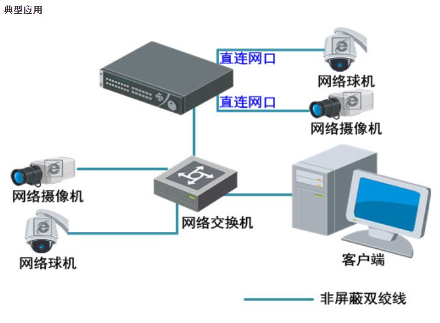

# hikvision-sdk
海康威视网络录像机（NVR）和网络摄像机（IPC）的封装类

## 一、功能包括：

1 实时视频预览
> 实时获取码流数据，如果传入了显示句柄，则视频会显示在窗口句柄上。

2 按时间查询历史视频
> 选择一个IPC和时间段，返回历史视频列表。

3 历史视频按照文件名回放
> 根据查询到的历史视频，进行历史回放。

4 历史视频按照时间回放
> 根据选择的时间段，进行历史视频的回放。

5 历史视频播放控制：快放、慢放、正常播放、暂停、恢复、拖动进度
> 历史视频在播放过程中，可以进行控制

6 实时预览抓图
> 实时预览过程中可以抓拍图片

7 历史回放抓图
> 历史回放过程中可以抓拍图片

8 云台控制
> 实时预览过程中可以进行云台控制

9 云台预置点设置
> 预置点设置、运行和删除

10 实时预览远程喊话
> 如果IPC支持语音对讲，则可以进行远程喊话

## 二、支持的网络拓扑图



## 三、代码示例
假设：

1、NVR的IP为192.168.1.64 用户名为 admin 密码为 admin1234

2、若要查询历史视频，摄像机需要接入NVR的通道，并正常录像

```c++
#include <iostream>
#include <iomanip>
#include "hksdk\hkobjectfactory.h"
using namespace std;
using namespace hksdk;

void test_ipc(hkobjectfactory &factory)
{
	cout << "测试实时预览" << endl;
	shared_ptr<hknvr> nvr = factory.get_nvr("192.168.1.64");
	if (!nvr)
		return;

	shared_ptr<hkipc> ipc;
	ipc = factory.create_ipc(nvr, "192.168.254.3", "admin", "admin1234");
	ipc->StartRealPlay(GetConsoleWindow());
	Sleep(100000);
}

void test_download_by_time(hkobjectfactory &factory)
{
	cout << "测试按照时间下载录像" << endl;
	shared_ptr<hknvr> nvr = factory.get_nvr("192.168.1.64");
	if (!nvr)
		return;

	shared_ptr<hkvideodownload> download = factory.create_download(
		nvr,
		"192.168.254.3",
		"2020-05-26 10:00:00",
		"2020-05-26 10:10:00",
		"d:\\123.mp4");

	download->StartDownload();
	while (download->GetProgress() != 100)
	{
		cout << "下载进度 " << download->GetProgress() << '\r';
		Sleep(1000);
	}
	cout << "下载进度 " << download->GetProgress() << endl;
}

void test_download_by_name(hkobjectfactory &factory)
{
	cout << "测试按照文件名下载录像" << endl;
	shared_ptr<hknvr> nvr = factory.get_nvr("192.168.1.64");
	if (!nvr) 
		return;

	std::list<FILE_RECORD_INFO> file_list;
	nvr->SearchPlayback(
		list<string>({ "192.168.254.3" }),
		"2020-05-26 10:00:00",
		"2020-05-26 10:30:00",
		file_list
	);

	shared_ptr<hkvideodownload> download = factory.create_download(nvr, file_list.begin()->file_name, "d:\\abc.mp4");
	download->StartDownload();

	while (download->GetProgress() != 100)
	{
		cout << "下载进度 " << download->GetProgress()<< '\r';
		Sleep(1000);
	}
	cout << "下载进度 " << download->GetProgress() << endl;
}

void test_playback_byname(hkobjectfactory &factory)
{
	cout << "测试按照文件名播放历史视频" << endl;
	shared_ptr<hknvr> nvr = factory.get_nvr("192.168.1.64");
	if (!nvr)
		return;

	std::list<FILE_RECORD_INFO> file_list;
	nvr->SearchPlayback(
		list<string>({ "192.168.254.3" }),
		"2020-05-26 10:00:00",
		"2020-05-26 10:30:00",
		file_list
	);

	shared_ptr<hkvideoplayback> playback = factory.create_playback(nvr, file_list.begin()->file_name);

	playback->StartPlayback(GetConsoleWindow());

	while (!playback->PlaybackDone())
	{
		cout << playback->GetCurrentFrame() << "/" << playback->GetTotalFrames() << '\r';
	}
	cout << playback->GetCurrentFrame() << "/" << playback->GetTotalFrames() << '\r';
}

void test_playback_bytime(hkobjectfactory &factory)
{
	cout << "测试按照时间播放历史视频" << endl;
	shared_ptr<hknvr> nvr = factory.get_nvr("192.168.1.64");
	if (!nvr)
		return;

	
	shared_ptr<hkvideoplayback> playback = factory.create_playback(nvr, 
		"192.168.254.3",
		"2020-05-26 10:00:00",
		"2020-05-26 10:00:20");

	playback->StartPlayback(GetConsoleWindow());

	while (!playback->PlaybackDone())
	{
		cout << playback->GetCurrentFrame() << "/" << playback->GetTotalFrames() << '\r';
	}
	cout << playback->GetCurrentFrame() << "/" << playback->GetTotalFrames() << '\r';
}

int main()
{
	hksdk::sdk_init();

	// 登录NVR
	hkobjectfactory factory;
	factory.login_nvr("192.168.1.64", "admin", "admin1234");

	test_ipc(factory);
	test_download_by_time(factory);
	test_download_by_name(factory);
	test_playback_bytime(factory);
	test_playback_byname(factory);
	
	hksdk::sdk_cleanup();
	return 0;
}
```

## 四、有疑问可以给我发邮件
email: tqy04070625@outlook.com